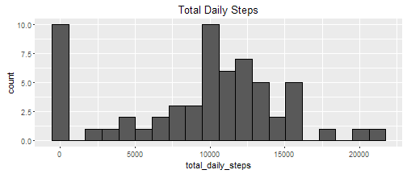
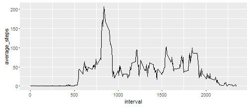
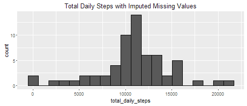
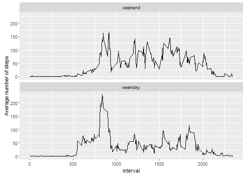

## Loading and preprocessing the data

We will load and convert the data to a `data.table`, for easy manipulation with simple syntax.

```r
library(data.table)
```

```
## data.table 1.9.4  For help type: ?data.table
## *** NB: by=.EACHI is now explicit. See README to restore previous behaviour.
```

```r
activity <- read.csv("activity.csv")
(activity <- as.data.table(activity))
```

```
##        steps       date interval
##     1:    NA 2012-10-01        0
##     2:    NA 2012-10-01        5
##     3:    NA 2012-10-01       10
##     4:    NA 2012-10-01       15
##     5:    NA 2012-10-01       20
##    ---                          
## 17564:    NA 2012-11-30     2335
## 17565:    NA 2012-11-30     2340
## 17566:    NA 2012-11-30     2345
## 17567:    NA 2012-11-30     2350
## 17568:    NA 2012-11-30     2355
```


## What is mean total number of steps taken per day?

1. *Make a histogram of the total number of steps taken each day*  

  
  ```r
  daily_steps <- activity[, .(total_daily_steps = sum(steps, na.rm=T)), by=date]
  
  library(ggplot2)
  ggplot(daily_steps, aes(total_daily_steps)) + 
      geom_histogram(bins=20, na.rm=T, color=1) +
      ggtitle("Total Daily Steps")
  ```
  
   

1. *Calculate and report the mean and median total number of steps taken per day*

  
  ```r
  mean_daily_steps <- mean(daily_steps$total_daily_steps)
  median_daily_steps <- median(daily_steps$total_daily_steps)
  ```
  The mean number of daily steps is 9354.2295082 and the median number of daily steps is 10395.


## What is the average daily activity pattern?

1. *Make a time series plot (i.e. type = "l") of the 5-minute interval (x-axis) and the average number of steps taken, averaged across all days (y-axis)*
  
  
  ```r
  steps_by_interval <- 
    activity[, .(average_steps = mean(steps, na.rm=T)), by=interval]
  
  ggplot(steps_by_interval, aes(interval, average_steps)) +
    geom_line()
  ```
  
   

1. *Which 5-minute interval, on average across all the days in the dataset, contains the maximum number of steps?*

  
  ```r
  (max_steps <- steps_by_interval[which.max(average_steps), ])
  ```
  
  ```
  ##    interval average_steps
  ## 1:      835      206.1698
  ```
  
  The maximum number of steps is 206.1698113 occuring in interval 835.


## Imputing missing values

1. *Calculate and report the total number of missing values in the dataset (i.e. the total number of rows with NAs)*

  
  ```r
  nMissing <- sum(is.na(activity$steps))
  cat("There are", nMissing ,"missing values")
  ```
  
  ```
  ## There are 2304 missing values
  ```
  
1. *Devise a strategy for filling in all of the missing values in the dataset. The strategy does not need to be sophisticated. For example, you could use the mean/median for that day, or the mean for that 5-minute interval, etc.*  

  We will make use of the `steps_by_interval` table, computed previously, for imputing the missing values. Each missing value is replaced by its interval's average number of steps, as given in `steps_by_interval`, and rounded to the nearest integer. The rounding is because the number of steps is assumed to be an integer.

1. *Create a new dataset that is equal to the original dataset but with the missing data filled in.*

  
  ```r
  # Set key of the data.table for quick indexing w.r.t. $interval
  setkey(steps_by_interval, interval)
  
  activity_imputed <- activity
  
  activity_imputed[ is.na(steps),
                  steps := round(steps_by_interval[.(interval), average_steps], )]
  ```
  
  ```
  ##        steps       date interval
  ##     1:     2 2012-10-01        0
  ##     2:     0 2012-10-01        5
  ##     3:     0 2012-10-01       10
  ##     4:     0 2012-10-01       15
  ##     5:     0 2012-10-01       20
  ##    ---                          
  ## 17564:     5 2012-11-30     2335
  ## 17565:     3 2012-11-30     2340
  ## 17566:     1 2012-11-30     2345
  ## 17567:     0 2012-11-30     2350
  ## 17568:     1 2012-11-30     2355
  ```


1. *Make a histogram of the total number of steps taken each day and Calculate and report the mean and median total number of steps taken per day. Do these values differ from the estimates from the first part of the assignment? What is the impact of imputing missing data on the estimates of the total daily number of steps?*

  
  ```r
  daily_steps_imputed <- 
      activity_imputed[, .(total_daily_steps = sum(steps, na.rm=T)), by=date]
  
  ggplot(daily_steps_imputed, aes(total_daily_steps)) + 
      geom_histogram(bins=20, na.rm=T, color=1) +
      ggtitle("Total Daily Steps with Imputed Missing Values")
  ```
  
   

  
  ```r
  mean_daily_steps_imputed <- mean(daily_steps_imputed$total_daily_steps)
  median_daily_steps_imputed <- median(daily_steps_imputed$total_daily_steps)
  ```

  |  | With Missing | Imputed |
  |---|:---:|:---:|
  | Mean | 9354.2295082| 10765.639344 |
  | Median | 10395| 10762 |

  The mean and median number of total daily steps changes upon imputation of missing values. In particular, the total daily steps necessarily increases as a result of including imputed values in the total, hence the mean and median increases as well.


## Are there differences in activity patterns between weekdays and weekends?

1. *Create a new factor variable in the dataset with two levels -- "weekday" and "weekend" indicating whether a given date is a weekday or weekend day.*

  
  ```r
  dayTypes <- factor(c("weekend", "weekday"), levels=c("weekend", "weekday"))
  weekend <- c("Saturday", "Sunday")
  
  activity_imputed[, dayOfWeek := weekdays(as.Date(date))]
  ```
  
  ```
  ##        steps       date interval dayOfWeek
  ##     1:     2 2012-10-01        0    Monday
  ##     2:     0 2012-10-01        5    Monday
  ##     3:     0 2012-10-01       10    Monday
  ##     4:     0 2012-10-01       15    Monday
  ##     5:     0 2012-10-01       20    Monday
  ##    ---                                    
  ## 17564:     5 2012-11-30     2335    Friday
  ## 17565:     3 2012-11-30     2340    Friday
  ## 17566:     1 2012-11-30     2345    Friday
  ## 17567:     0 2012-11-30     2350    Friday
  ## 17568:     1 2012-11-30     2355    Friday
  ```
  
  ```r
  activity_imputed[, dayType := dayTypes[2 - (dayOfWeek %in% weekend)]]
  ```
  
  ```
  ##        steps       date interval dayOfWeek dayType
  ##     1:     2 2012-10-01        0    Monday weekday
  ##     2:     0 2012-10-01        5    Monday weekday
  ##     3:     0 2012-10-01       10    Monday weekday
  ##     4:     0 2012-10-01       15    Monday weekday
  ##     5:     0 2012-10-01       20    Monday weekday
  ##    ---                                            
  ## 17564:     5 2012-11-30     2335    Friday weekday
  ## 17565:     3 2012-11-30     2340    Friday weekday
  ## 17566:     1 2012-11-30     2345    Friday weekday
  ## 17567:     0 2012-11-30     2350    Friday weekday
  ## 17568:     1 2012-11-30     2355    Friday weekday
  ```

1. *Make a panel plot containing a time series plot (i.e. type = "l") of the 5-minute interval (x-axis) and the average number of steps taken, averaged across all weekday days or weekend days (y-axis).*

  
  ```r
  steps_by_interval_dayType <- 
      activity_imputed[, .(`Average number of steps` = mean(steps)), by=.(interval, dayType)]
  
  ggplot(steps_by_interval_dayType, aes(interval, `Average number of steps`)) +
      geom_line() +
      facet_wrap( ~ dayType, ncol=1)
  ```
  
   

